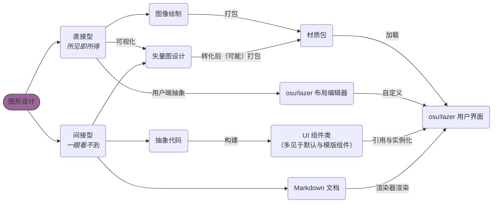

# 布局与界面设计

osu!lazer 的布局框架究竟是个什么样子，沐雨酱搞了两个多月，也并没有完全搞清楚。可能用 FillFlowContainer 与相对坐标的思路比较好，搞了个大舞台，可惜后来冒烟起火了...

...大型纪录片：《将设计进行到底》，正在播出...

## 概述

在与计算机相关的*图形*设计中，我们常常能接触到的无非两类：

- 直接设计（也就是使用绘图、布局可视化工具进行的设计，所见即所得）
- 间接设计（即使用代码、样式定义等进行的设计，可能没有所见，~~也没有所得~~）

这么概括似乎有些过度，但是一定程度上能够反映设计方面的大致情况。对于 osu!lazer 不同地方涉及到的设计方式，可以看一眼下图：



从系列标题中不难见得，这部分的内容大多与**代码层面的抽象设计**相关。

出于软件构建的性质，osu!lazer 的界面设计有这些特性：

- 精准直接：各个组件的属性都通过代码定义
- 易于复用：一个组件类可以在多个组件与界面使用
- 预览不易：每次更改之后需要将所在项目重新构建，出错的话需要通过日志/调试定位（有时甚至难以定位，谜语人了解一下）

总之，希望这系列文章能帮你设计出不错的 osu!lazer 界面与组件😋

## 我阐释你的码

这边是 osu!lazer 开发过程中，比较稀松平常的一个组件类。然而在运行的时候出现了一些问题，并导致了客户端的卡死与闪退。

尝试阅读下代码，然后找找问题吧。

```csharp
using System.Drawing;
using osu.Framework.Graphics.Containers;
using osu.Framework.Graphics;
using osu.Framework.Allocation;
using osuTK.Graphics;
using osu.Framework.Extensions.Color4Extensions;
using osu.Game.Graphics;
using osu.Framework.Bindables;
using osu.Framework.Graphics.Sprites;
using osuTK;

namespace osu.Game.Tournament.Components
{
    // This class makes osu!lazer crash. Why?
    public partial class WindowSizeIndicator : CompositeDrawable
    {
        private BindableSize sizeBindable = new BindableSize();

        private TournamentSpriteText winWidthText = null!;
        private TournamentSpriteText winHeightText = null!;

        public WindowSizeIndicator(BindableSize bSize)
        {
            Anchor = Anchor.BottomRight;
            Origin = Anchor.BottomRight;

            sizeBindable = bSize;
            sizeBindable.BindValueChanged(bindSizeChanged);
        }

        [BackgroundDependencyLoader]
        private void load()
        {
            Width = 150;
            Height = 100;
            Alpha = 0;
            AlwaysPresent = true;

            InternalChildren = new Drawable[]
            {
                new EmptyBox(cornerRadius: 10)
                {
                    RelativeSizeAxes = Axes.Both,
                    Colour = Color4.Black.Opacity(0.6f),
                },
                new FillFlowContainer
                {
                    RelativeSizeAxes = Axes.Both,
                    Direction = FillDirection.Vertical,
                    Spacing = new Vector2(5),
                    Children = new Drawable[]
                    {
                        new FillFlowContainer
                        {
                            Height = 40,
                            Direction = FillDirection.Horizontal,
                            Spacing = new Vector2(5),
                            Children = new Drawable[]
                            {
                                new SpriteIcon
                                {
                                    Icon = FontAwesome.Solid.RulerHorizontal,
                                    Size = new Vector2(24),
                                },
                                winWidthText = new TournamentSpriteText
                                {
                                    Text = sizeBindable.Value.Width.ToString(),
                                    Colour = TournamentGame.TEXT_COLOUR,
                                    Font = OsuFont.Torus.With(size: 20, weight: FontWeight.SemiBold),
                                },
                            }
                        },
                        new FillFlowContainer
                        {
                            Height = 40,
                            Direction = FillDirection.Horizontal,
                            Spacing = new Vector2(5),
                            Children = new Drawable[]
                            {
                                new SpriteIcon
                                {
                                    Icon = FontAwesome.Solid.RulerVertical,
                                    Size = new Vector2(24),
                                },
                                winWidthText = new TournamentSpriteText
                                {
                                    Text = sizeBindable.Value.Height.ToString(),
                                    Colour = TournamentGame.TEXT_COLOUR,
                                    Font = OsuFont.Torus.With(size: 20, weight: FontWeight.SemiBold),
                                },
                            }
                        },
                    }
                },
            };
        }

        private void bindSizeChanged(ValueChangedEvent<Size> e)
        {
            winWidthText.Text = e.NewValue.Width.ToString();
            winHeightText.Text = e.NewValue.Height.ToString();
        }
    }
}
```

<details>
  <summary>点击阐释你的码</summary>

  这段代码量确实不小，不过错误也算相对简单...

  在这个类中，`winWidthText` 在两个并列的 `FillFlowContainer` 中被赋值了两次，导致其错误地将应该显示高度的字段改成了宽度。同时，由于 `winHeightText` 始终为 `null`，在调用 `bindSizeChanged` 时会出现空引用而导致报错。

  不过也正是因为代码量大，导致我一度怀疑是 `FillFlowContainer` 的特性，排错排了二十多分钟😠

  各位在写这样的代码时，别忘了检查变量调用和空引用啊（震声
</details>
