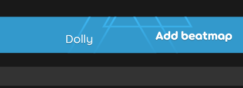

# 说的道理教你写小部件

:::note 🤔

大家好啊，我是复予。

今天有点忙来不及写文章了，就让咱们的赛博生命**说的道理** (Short Dolly) 来帮忙写写下面的内容吧...

诶不是哥们我

:::

大家好啊，我是说的道理。今天来点大家想看的东西啊。

小部件 (**Widget**，维吉特) 说的道理是用户界面 (**User Interface**，有爱) 上的一部分显示内容啊，从设计层面上来讲，是一个小的组成单元啊。今天就来带带各位给 osu!lazer 写一个小部件啊。

## 类初始化

手先，我们在 `Ottoman`（电棍南）项目里建一个类文件，为什么要在这里建啊：

- Ruleset（如嗯塞特）项目给咱们提供了一个很好的测试环境啊，里面依赖、基本组件啥的什么都有啊。

:::info 说明

复予：实际上由于 Ruleset 输出的是类库文件，除非使用自动化脚本把输出库文件移动到 lazer 目录，否则每次手动操作替换还是有点麻烦的。

因此这里有另外的方法是使用 osu!lazer 的源码，在其中创建组件类，放在恰当方便的位置，测试时直接构建运行就好了，不过相应的构建时间会有点长，不够“轻量”。

如果你想的话，也可以在整个解决方案里开一个这样的项目，然后加依赖与引用就行了。当然这个方法我没多测，需要后续研究。

:::

啊！怎么有一个叫复予的击败在这里开大！大家不要听这个真纪头的话，我们的教程无法被定义！

好，我们接下来新建一个类文件，比如说的道理维吉特：

```csharp title="osu.Game.Rulesets.Ottoman/Components/ShortDollyWidget.cs"
using osu.Framework.Graphics.Containers;

namespace osu.Game.Rulesets.Ottoman.Components
{
    public partial class ShortDollyWidget : CompositeDrawable
    {
    }
}
```

引用（实现或者继承）这个 `CompositeDrawable` 是为了接续使用它的属性和方法啊。

:::tip 问题

在上面这段代码中，如果主类不使用 `partial` 修饰，会出现警告：

```bash
OFSG001: Types that are candidates for dependency injection should be made partial to benefit from compile-time optimisations.
```

经过一小段时间的研究，可能原因是出于：

- 构建工具会生成含有这个类的文件，`partial` 有助于使其与原有类共存。经过一些调查，可能与类中对象的标注 (**Annotation**) 有关。

```csharp title="自动生成的类示例"
// <auto-generated/>
#nullable enable
#pragma warning disable CS4014

namespace osu.Game.Tournament.Screens.Board
{
    partial class BoardScreen : global::osu.Framework.Allocation.ISourceGeneratedDependencyActivator
    {
        public override void RegisterForDependencyActivation(global::osu.Framework.Allocation.IDependencyActivatorRegistry registry)
        {
            if (registry.IsRegistered(typeof(global::osu.Game.Tournament.Screens.Board.BoardScreen)))
                return;
            base.RegisterForDependencyActivation(registry);
            registry.Register(typeof(global::osu.Game.Tournament.Screens.Board.BoardScreen), (t, d) =>
            {
                ((global::osu.Game.Tournament.Screens.Board.BoardScreen)t).sceneManager = global::osu.Framework.Utils.SourceGeneratorUtils.GetDependency<global::osu.Game.Tournament.TournamentSceneManager?>(d, typeof(global::osu.Game.Tournament.Screens.Board.BoardScreen), null, null, true, true);
                ((global::osu.Game.Tournament.Screens.Board.BoardScreen)t).load(global::osu.Framework.Utils.SourceGeneratorUtils.GetDependency<global::osu.Framework.Graphics.Textures.TextureStore>(d, typeof(global::osu.Game.Tournament.Screens.Board.BoardScreen), null, null, false, false));
            }, null);
        }
    }
}
```

- 依赖注入更灵活？
- 代码组织？
- 测试方便？

上面这些内容出于 AI，暂时没摸透，有懂哥的话可以在评论区交流交流。
:::

## 加载函数

不是你恶心人有个度啊！

好，接下来来写加载 (**Load**，罗德) 函数啊。

```csharp
namespace osu.Game.Tournament.Components
{
    public partial class ShortDollyWidget : CompositeDrawable
    {
        [BackgroundDependencyLoader]
        private void load()
        {
            // Dolly goes here!
        }
    }
}
```

这里要加一个 `BackgroundDependencyLoader` 标注 (**Annotation**，嗯诺特什) 可以让电棍类能够使用这个方法初始化啊。

:::tip 正经的提示

带有 `[BackgroundDependencyLoader]` 标注的函数，在类初始化后会先行执行，准备好后续步骤需要的一些东西。

如果一个类里面加了多个这样的标注，则会按**定义**的顺序依次执行。可以通过写能够输出日志（或者其他途径）的方法来测试。

:::

不管怎样，现在给大家一点想看的东西啊。加载函数里面有一些定义组件属性的语句啊，比如锚点 (**Anchor**，安史)、原点 (**Origin**，嗷嘞进)、子元素 (**Children**，抽真) 之类的啊，会在以后的开发过程中起很大作用的啊。

osu!lazer 同时也提供了很多能直接使用的组件类啊，这里我们使用一下它给的文本组件 `SpriteText` 啊。

```csharp title="nm$lclass"
/// Truncated
        [BackgroundDependencyLoader]
        private void load()
        {
            // Dolly goes here!
            Anchor = Anchor.Centre;
            Origin = Anchor.Centre;

            InternalChildren = new Drawable[]
            {
                // 怎么画红线了？我阐释你的梦！
                // new SpriteText
                new OsuSpriteText
                {
                    Text = "Dolly",
                }
            }
        }
/// Truncated
```

哇袄！牛魔 ppy，`SpriteText` 为什么不能用啊，为什么啊？

## 成果展示

总之最后是做好了，看一下效果：



什么？你问锚点和原点是什么意思，`InternalChildren` 又是什么？铸币吧，怎么这么菜啊！菜就多练懂不懂啊。**我们的教程，还有说的道理，是无法被定义的！**

啊阿吖！没出生在我心s\~

哈姆\~一呼相当饿\~

啊你，也列拿fish

黑波比麻fishes

啊米浴说的道理！

啊wish，多多wish！

啊饿~好饿一食得当

啊嘛啊！波比是我爹

啊~喵内地手啊呵呵木有

:::info ❔

复予：一眼顶针，鉴定为缺爱了。

你等着，我马上就来。

:::

啊哥们我错啦！下次还敢\~

哈哈哈哈哈哈哈，哈哈哈，哈喝\~开玩笑的说，区区一个小杂鱼能怎么我了。

:::tip 希望你真的是在开玩笑


WW91IGtub3cgd2hhdCB0byBkbyBuZXh0LiBIZXJlIGlzIHlvdXIgZmxhZzoKZmxhZ3tYaW9uZ19EaV9YaWFuZ19DaGFuX1NoaV9OaX0K

:::

不行！不\~行！啊在颤抖，我的身体队友呢队友呢救一下啊啊，啊，哇袄！

---

孩子们，我是复予，我回来了。

道理写的内容其实主要部分没有问题，不过加载函数的写法是有些过于随意了，以至于不符合我们期望的设计规范，有些地方的解释也不是很到位，总之不是好教程就是了。

漏出来的部分，接下来的文章会好好接下的。
