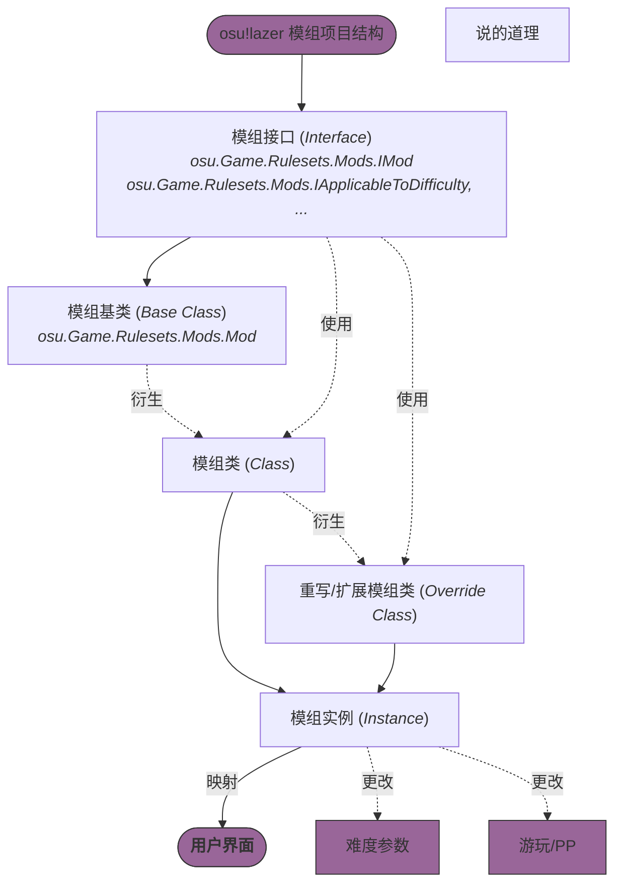

# 模组

模组（**Mod**，即 *Game Modifier*），是 osu!lazer（以及 stable）中一个较为重要的组成部分，可以更改谱面或游戏的部分参数，从而调节游戏体验或增加乐趣。

:::note 模组详情

要了解更多关于模组的信息，可以参阅 [osu!wiki 的相关部分](https://osu.ppy.sh/wiki/zh/Gameplay/Game_modifier)。

:::

## 作用原理

osu!lazer 现有的所有模组都是基于 `osu.Game.Rulesets.Mods.Mod` 这个基本类，通过定义一些参数与使用接口来实现的。下面的图表简单阐释了模组从定义到在用户界面中显示的大致过程。



简而言之：

- `osu.Game.Rulesets.Mods.Mod` 是最基本的模组类，实现 `IMod` 接口。这样的模组至少能在模组列表中显示。
- 除了 `IMod` 接口之外，还有许多不同的接口，让模组能够进行对应方面的更改。
- 通过实现 `Mod` 基本类，一些模组能在做到基本功能的同时，实现一些其他的功能（通过实现不同的接口）。
- Ruleset 中可以通过引用已有类，也可以通过写一个实现已有类的新类，为 Ruleset 添加模组。
- 在代码中（一般是界面相关）可以通过使用模组类的实例，让模组的功能应用在用户界面、难度、统计信息等等方面。

## 属性

如果读读 `IMod` 接口以及 `Mod` 基本类的源码，应该能找出模组的一些基本信息。

### `Acronym`

```csharp
/// <summary>
/// The shortened name of this mod.
/// </summary>
string Acronym { get; }
```

模组名称的缩写，一般为两个或三个字符，会显示在模组菜单中的图标下方，以及一些其他的地方 (?)；如果没有模组图标，就会直接显示这个文本。

### `Name`

```csharp
/// <summary>
/// The name of this mod.
/// </summary>
string Name { get; }
```

模组的全名，建议尽量短小，会在多数情况下（如模组菜单，图标悬停工具提示等等）显示。

### `ExtendedIconInformation`

```csharp
/// <summary>
/// Short important information to display on the mod icon. For example, a rate adjust mod's rate
/// or similarly important setting.
/// Use <see cref="string.Empty"/> if the icon should not display any additional info.
/// </summary>
string ExtendedIconInformation { get; }
```

会在模组图标右侧向右展开一个部分，在其中以模组背景颜色显示文本。如果属性字符串为空 (`string.Empty`) 则不会显示。

这个属性一般不会在模组类内部硬编码。相对地，我们通常会将某个设置的数值（例如 Double Time 模组中的设置倍速）作为参数，将这个属性调整为包含其数值的字符串。

### `Description`

```csharp
/// <summary>
/// The user readable description of this mod.
/// </summary>
LocalisableString Description { get; }
```

模组的描述，显示在模组菜单列表项的第二行。

### `Type`

```csharp
// <summary>
// The type of this mod.
// </summary>
ModType Type { get; }
```

模组所属类型，决定这个模组显示的类别位置与背景颜色（因为背景颜色一般是由类别决定的）。

:::info 类型详情

对于你可以使用的模组类型信息，可以参考[下文这一部分](#分类)。

:::

### `Icon`

```csharp
/// <summary>
/// The icon of this mod.
/// </summary>
IconUsage? Icon { get; }
```

模组的图标，使用你想要的方式（例如 `TextureStore` 或者 `FontAwesome` 等等）来确定一个。

好的图标能帮助玩家与开发者一眼丁真，所以建议设计一个醒目直观点的。

### `UserPlayable`

```csharp
/// <summary>
/// Whether this mod is playable by an end user.
/// Should be <c>false</c> for cases where the user is not interacting with the game (so it can be excluded from multiplayer selection, for example).
/// </summary>
bool UserPlayable { get; }
```

用户能否**直接**使用这个模组。从表面换句话来说，就是能不能**主动**选择模组。

如果你的模组是通过内部逻辑自动更改的（例如 `Touch Device`），则可以将这个属性设置为 `false`。

### `ValidForMultiplayer`

```csharp
/// <summary>
/// Whether this mod is valid for multiplayer matches.
/// Should be <c>false</c> for mods that make gameplay duration dependent on user input (e.g. <see cref="ModAdaptiveSpeed"/>).
/// </summary>
bool ValidForMultiplayer { get; }
```

玩家能否在多人游戏房间中选择这个模组。

### `ValidForMultiplayerAsFreeMod`

```csharp
// <summary>
// Whether this mod is valid as a free mod in multiplayer matches.
/// Should be <c>false</c> for mods that affect the gameplay duration (e.g. <see cref="ModRateAdjust"/> and <see cref="ModTimeRamp"/>).
/// </summary>
bool ValidForMultiplayerAsFreeMod { get; }
```

房主在多人游戏房间中启用自由模组 (`FreeMod`) 时，玩家能否选择这个模组。

### `AlwaysValidForSubmission`

```csharp
/// <summary>
/// Indicates that this mod is always permitted in scenarios wherein a user is submitting a score regardless of other circumstances.
/// Intended for mods that are informational in nature and do not really affect gameplay by themselves,
/// but are more of a gauge of increased/decreased difficulty due to the user's configuration (e.g. <see cref="ModTouchDevice"/>).
/// </summary>
bool AlwaysValidForSubmission { get; }
```

玩家能否上传带这个模组的游玩分数。

对于指示性的模组（例如 `Touch Device`）来说，因为它们不会影响游玩，所以可以设置为 `true`。

### `Ranked`

```csharp
/// <summary>
/// Whether scores with this mod active can give performance points.
/// </summary>
bool Ranked { get; }
```

玩家用这个模组的游玩分数能否*进榜*（换句话说，*参与排行榜排名*）。

osu!lazer 模组菜单的右下角会显示能否进榜的状态。

### `IncompatibleMods`

```csharp
/// <summary>
/// The mods this mod cannot be enabled with.
/// </summary>
[JsonIgnore]
public virtual Type[] IncompatibleMods => Array.Empty<Type>();
```

这个模组与哪些模组互斥，也就是无法同时启用。

## 分类

模组分为不同的类别，这些类别会改变模组显示的位置与背景颜色。

所有的类别信息都存放在 `osu.Game.Rulesets.Mods.ModType` 枚举里面：

| 代码项 | 描述 | 主题色 |
| :-: | :-: | :-: |
| DifficultyReduction | 降低难度的模组 | <Highlight color="#b2ff66">草绿色</Highlight> |
| DifficultyIncrease | 增加难度的模组 | <Highlight color="#ff6666">红色</Highlight> |
| Conversion | 变换模组 | <Highlight color="#8c66ff">紫色</Highlight> |
| Automation | 自动化（辅助）模组 | <Highlight color="#66ccff">蓝色</Highlight> |
| Fun | 趣味模组 | <Highlight color="#ff66ab">粉色</Highlight> |
| System | 系统（内部）模组，一般无法直接选择 | <Highlight color="#ffd966">黄色</Highlight> |

## 实装模组

如果要让一个模组在模组设置页面中显示，需要在 Ruleset 类的 [`GetModsFor()`](./basic#getmodsfor) 函数中进行引用。

这个函数大体上使用的是一个 `switch` 语句块，将不同分类 (`case`) 下的不同模组都列举出来，作为一个模组数组 (`new Mod[]`) 返回。

为了避免分类改变或新增导致的意外情况，建议在这里对其他情况 (`default`) 返回空数组。

```csharp title="osu.Game.Rulesets.Ottoman/OttomanRuleset.cs"
public override IEnumerable<Mod> GetModsFor(ModType type)
{
    // Here goes mods of all categories
    switch (type)
    {
        case ModType.DifficultyReduction:
            return new Mod[]
            {
                new OttomanModEasy(),
                new OttomanModNoFail(),
                new MultiMod(new OttomanModHalfTime(), new OttomanModDaycore()),
            };

        default:
            return Array.Empty<Mod>();
    }
}
```

## 引入模组

在初步开发一个 Ruleset 时，你也许想先把一些现有的模组搬到这边来。

对于常规的 Ruleset，我们可以这样引入模组：

- 会先考虑引入一些常规、通用的模组：Half Time 等调速模组
- 然后引入简单处理的模组：Easy 等调参模组
- 再引入需要特殊处理的模组：Autoplay 等 Ruleset 强相关的模组（为啥与上面分开来？因为需要的处理**太多惹**）

### 引入方式

对于全局性的（换句话说，与 Ruleset 无关的）模组，可以直接引用 `osu.Game` 中的现有类。

如果不是这样，或者说你想对它进行进一步的修改（小到描述文本，大到作用逻辑），就需要在这个项目中自己写一个类，并继承已有的模组。

对于以上这些，可以看看下面的[实例](#示例)。

代码中的 `MultiMod` 用来将多个模组并入一组。

:::tip 问题

除了实现逻辑上的“分组”，使用 `MultiMod` 圈入多个模组有什么实质上的意义？

这个问题可能在不久后得到回答。

:::

## 示例

来！

### 套用原有模组

在 Ottoman Ruleset 中引入 Sudden Death 与 Perfect 模组，并更改其描述。

```csharp title="osu.Game.Rulesets.Ottoman/Mods/OttomanModSuddenDeath.cs"
using osu.Game.Rulesets.Mods;

namespace osu.Game.Rulesets.Ottoman.Mods
{
    // Create this class based on ModSuddenDeath
    // Same for Perfect
    public class OttomanModSuddenDeath : ModSuddenDeath
    {
        // Use override
        public override LocalisableString Description =>
          @"一言不合，就阐释你的梦。";
    }
}
```

在 Ruleset 类中做这样的更改：

```csharp title="osu.Game.Rulesets.Ottoman/OttomanRuleset.cs"
// Other content truncated...
namespace osu.Game.Rulesets.Ottoman
{
    public class TyperRuleset : Ruleset
    {
        public override IEnumerable<Mod> GetModsFor(ModType type)
        {
            switch (type)
            {
                case ModType.DifficultyIncrease:
                    return new Mod[]
                    {
                        new MultiMod(new TyperModSuddenDeath(), new TyperModPerfect()),
                    }
            }
        }
    }
}
```

示例补充中...
