# Part 1: 准备工作

Lazer是开源项目，你可以在GitHub上找到托管Lazer源代码的仓库：[传送门](https://github.com/ppy/osu)。

:::info 提示

您可能需要特殊的网络环境来访问GitHub。

:::

进入页面后，点击右下角的 **Releases** 以获取各个版本的安装包。“Latest”代指最新的稳定版本。

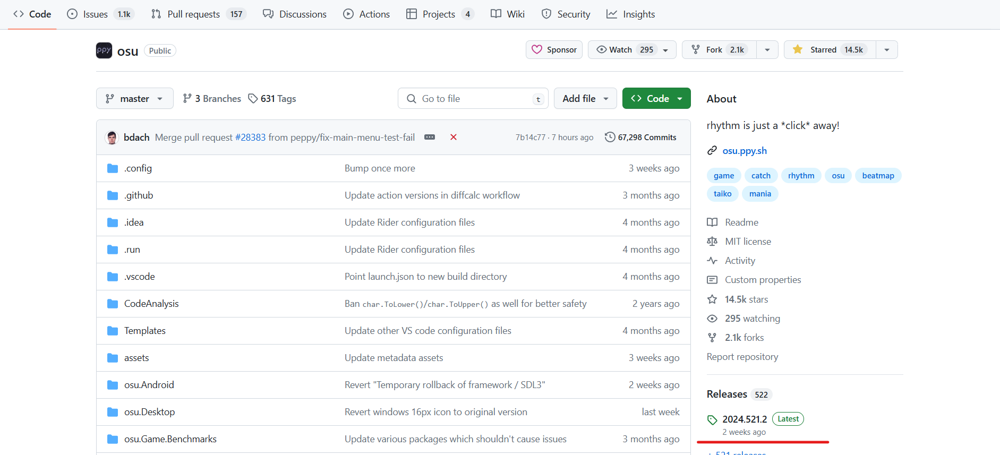

---

Assets下方展示了所有可供下载的资源。作为普通玩家，主要下载这些文件即可：

- `install.exe` 是 Windows 操作系统的安装程序
- `sh.ppy.osylazer.apk` 是 Android 系统的安装包
- `osu.iOS.ipa` 用于 iOS 上 Lazer 的安装
- `osu.app.Apple.Silicon.zip` 适用于 MacOS
- `osu.AppImage` 用于在 Linux 系统运行

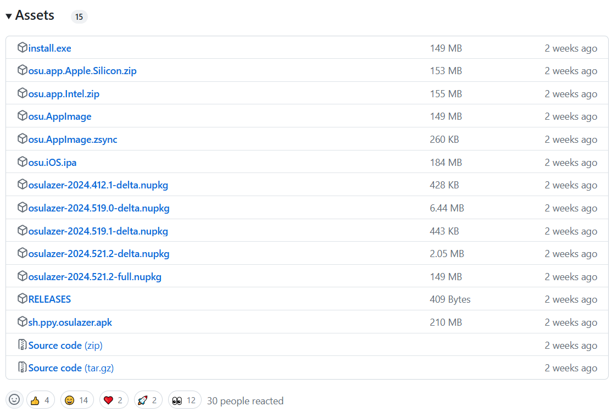

:::info 对于 Linux 用户

您也许更想使用 **Flatpak** 下载发布的版本，这样手动更新会更加方便。点击查看[应用详情](https://flathub.org/apps/sh.ppy.osu)。

您可以选择使用系统自带的应用商店进行安装，也可以使用命令行：

```sh
flatpak install sh.ppy.osu
```

:::

你也可以在 [osu! 官网](https://osu.ppy.sh/home/download)下载 osu!lazer。下载Lazer请点击右边的按钮，左边的按钮会下载stable。

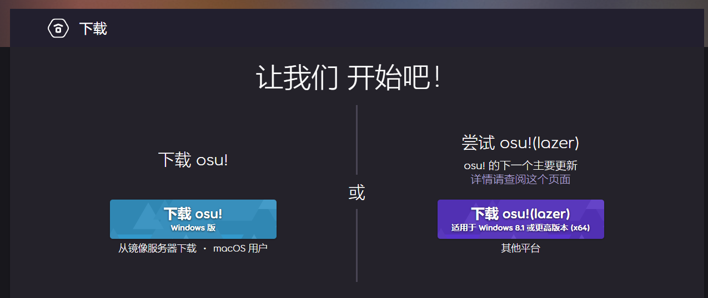

运行安装后稍等一会，就可以在你的电脑的某个角落找到Lazer了。

## 首次启动设置

初次启动Lazer，你首先会看到“首次启动设置”。在这里你可以快速设置好你的游戏偏好，从stable导入数据，以及获取推荐谱面。下面介绍几个比较重要的设置：

### 语言设置

在这里选择显示的界面语言，您可能会希望选择 **简体中文** 或 **繁体中文**。

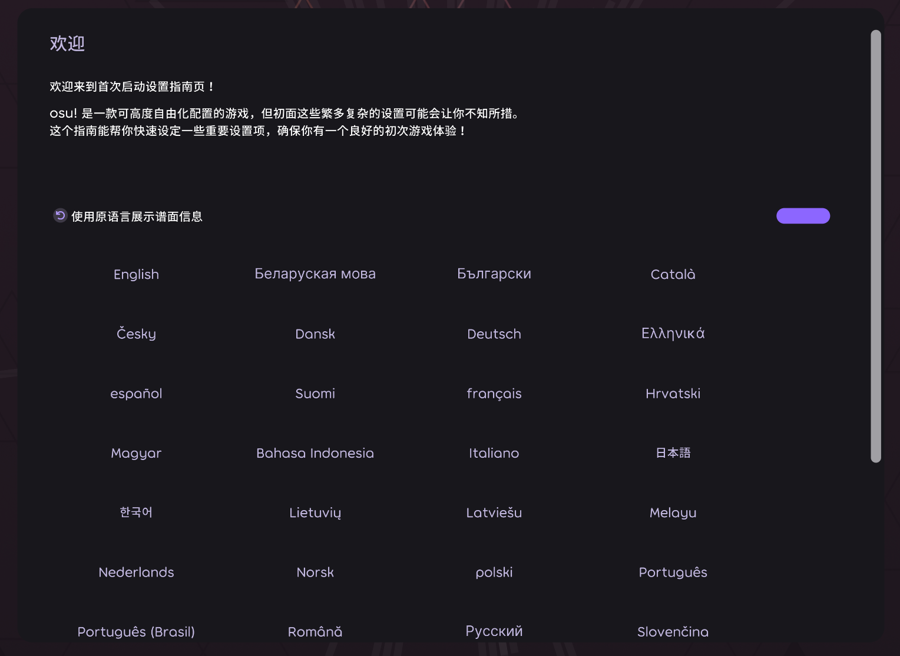

**“使用原语言展示谱面信息”** 启用后，会按原样显示谱面原来设置的相关信息，反之只会用罗马方式表示。

### 界面缩放

在这里可以调节 Lazer 全局的界面尺寸，向右拖动滑块可放大界面，反之亦然。

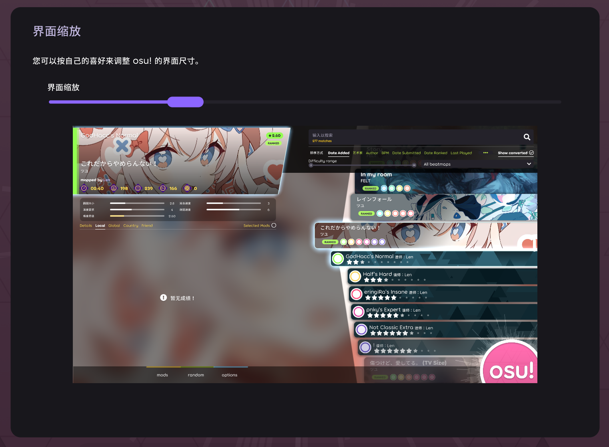

如果主界面对您来说太大或太小，那么这一步可能会有帮助。

### 获取谱面

如果您是萌新，可以直接点击 **“获取 osu! 新手教程谱面”** 下载入门谱面（也就是 [new beginnings](https://osu.ppy.sh/beatmapsets/1011011#osu/2116202)）；也可以点击 **“获取推荐谱面”**，为您一键下载最近比较热门的推荐谱面。

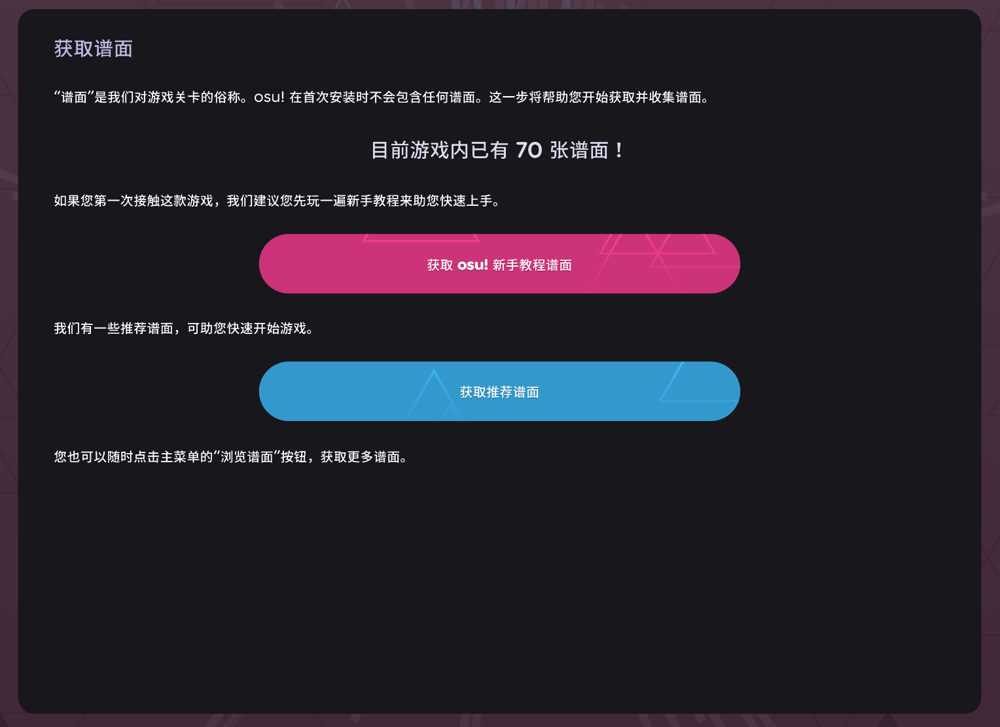

:::warning 警告

如果您还没有 osu! 账号，那么建议您先在这里下载点谱面。

退出这个向导后，您需要**登录**才能使用谱面下载功能。

:::

:::info 提示

这一步需要良好稳定的网络连接。如果条件不满足，或者您想要稍后下载（并且有一个可用的 osu! 账户），可以先转到下一步。

:::

### 导入

对于从未接触过 osu! 的萌新来说，这一步基本可以跳过。而对于从stable转来的玩家，这一步尤为重要。

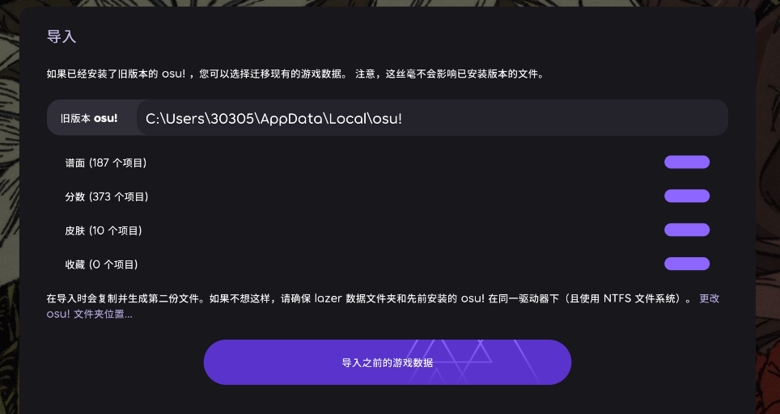

Lazer 会自动检测您计算机上 stable 的安装位置。如果路径错误，您可以点击“旧版本osu!”文字框更改路径。

勾选你想导入的数据，然后点击“导入之前的游戏数据”按钮即可完成数据导入。

:::warning 导入数据前...

如果您的Lazer和stable<u>没有安装在同一驱动器下</u>，或者<u>文件系统不是NTFS</u>，导入数据时会复制并生成第二份文件。由于Lazer默认数据存储位置在C盘，可能会导致**C盘爆红**。

可以点击“导入之前的游戏数据”上方蓝色小字“**更改osu!文件夹位置..**”来更改Lazer的数据存储路径。

:::

:::tip 小提示

很不幸，Android 等移动平台不支持 stable 数据导入，也不支持从外部导入谱面。

如果想在 Linux 等平台导入 stable 的数据，可以使用一种讨巧的方法。

1. 将 Windows（或其他平台）上 stable 的文件夹压缩成单个文件（以便节省后续操作时间）。
2. 将压缩包传输给需要的设备，选一个 Lazer **可以访问** 的位置解压。
3. 启动 Lazer，进入设置向导。
4. 在向导中选择解压文件所在的目录，Lazer 会自动识别稳定版数据，正常导入即可。

:::

### 游戏表现

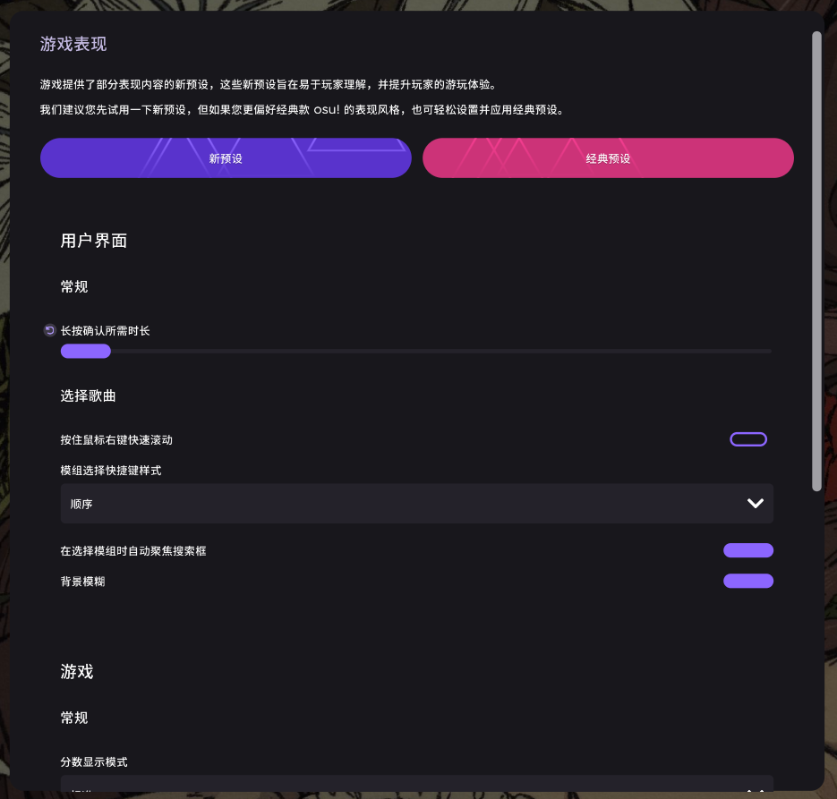

你可以在这一部分更改你的游戏偏好。关于设置的详细说明会在[这里](setting)进行总结。

点击“完成”按钮完成首次启动设置。

## 登录或注册账号

在登录有效的 osu! 账号后，才能使用 Lazer 的完整功能。

未登录时，每次启动 Lazer 应会弹出用户登录面板。如果没有，可以点击右上方的 `Guest` 按钮登录。

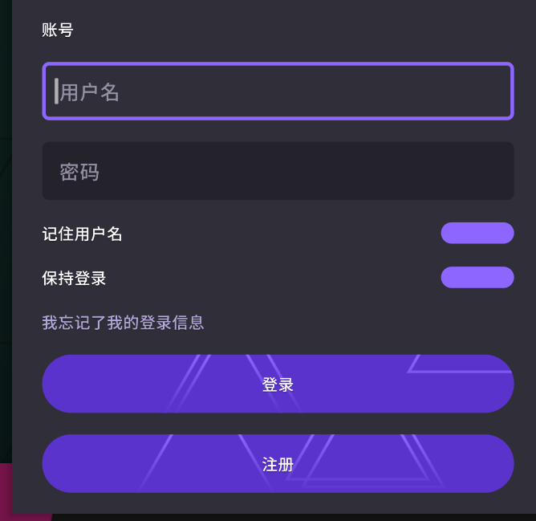

- 若您已有账号，可以直接输入信息并登录了。

  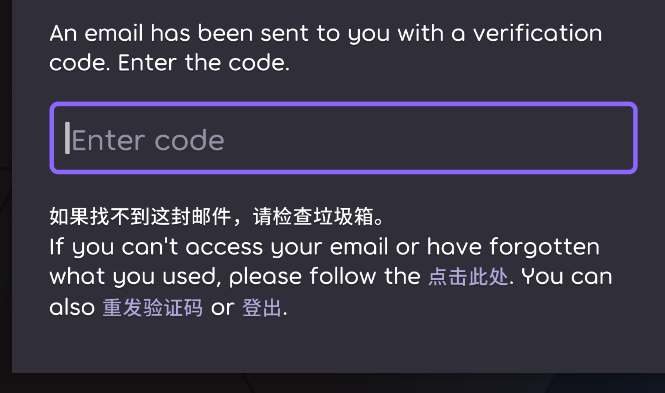
  可能会要求您输入验证码，请在您的电子邮件收件箱中找到并输入进去。
- 若您还没有账号，请点击 **“注册”**，按照要求填入所需信息后提交。
  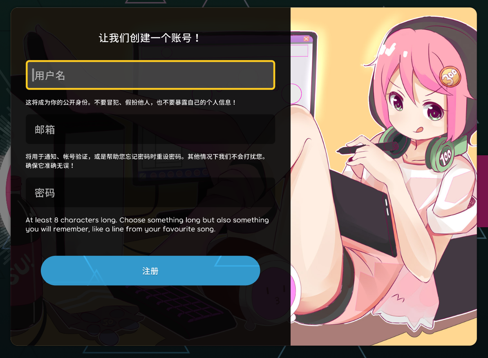

到此为止，您应已配置好了 osu!lazer 并使用自己的账号登录了。祝游玩愉快！
