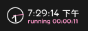

import slidersneakin from './img/slider-sneakin.gif';
import slidernosneakin from './img/slider-nosneakin.gif';
import slidersneakout from './img/slider-sneakout.gif';
import slidernosneakout from './img/slider-nosneakout.gif';
import bordernone from './img/border-none.jpg';
import bordercorner from './img/border-corner.jpg';
import borderfull from './img/border-full.jpg';

# Part 2: 游戏设置

在开始游戏前，推荐您先调整好你自己喜欢的游戏习惯。可以使用以下方式，打开设置面板：

- 点击 osu! 粉饼后，点击左侧的（灰色）进入设置页面
- 点击左上角的也可以进入设置。
- 在游戏过程中的任何时候，您都可以使用快捷键 `Ctrl + O` 进入设置菜单。

打开设置页后，你可以直接输入你想搜索的设置条目。

点击按钮可以恢复该设置默认值。

:::warning 注意

不同平台的设置显示的条目和选项可能不同。以下设置以 Windows 端为例，版本 `2024.625.2`。

:::

:::info 目录位置

在介绍设置前，建议您记住 osu!lazer 的*默认*安装与数据目录（或者建个快捷方式），以便日后使用。

- 安装目录：`C:\Users\<用户名>\AppData\Local\osulazer`
- 数据目录：`C:\Users\<用户名>\AppData\Roaming\osu`

数据目录中的文件，在卸载等操作后依然会保留。

:::

## 常规

常规设置组包含了最基本的Lazer设置。

- **“打开设置向导”** 可以再次启动之前提到过的首次启动设置。
- 点击 **“进一步了解lazer”** 会跳转到 osu! wiki 中的“[升级到 lazer](https://osu.ppy.sh/wiki/zh/Help_centre/Upgrading_to_lazer)”页面。
- 打开 **“使用原语言展示谱面信息”** 会在选歌页面使用歌曲的原语言展示歌曲信息。

   →

   →

:::info 双修玩家请注意！

如果你是 stable 和 Lazer 双修玩家，你可能需要经常点击“打开设置按钮”来将 stable 中的数据导入 lazer。

如果想将 lazer 中的数据导入 stable：

- 皮肤：`设置` -> `导出当前皮肤`
- 回放：点击本地排行榜中的分数，按下 `F2`
- 谱面：参见[lazer-stable 谱面互转指南](../lazermap2st)

在此之后，请在 osu!lazer 的**数据目录**的 `exports` 文件夹中找到导出内容，并手动将其导入 osu!stable。

:::

- **“使用24小时制时间”** 会在右上角的时间显示部分使用24小时制展示当前时间。

  →
- **“检查更新”** 顾名思义。
- **“打开osu!文件夹”** 会使用系统文件管理器打开Lazer的安装文件夹。
- **“导出日志”** 会将日志导出到Lazer安装目录下 `exports` 文件夹内。导出的日志以压缩包 `compressed-logs.zip` 的样式呈现。
- **“更改osu!文件夹位置”** 可以更改Lazer的安装位置。推荐各位在初次安装后先迁移自己的Lazer安装位置。

:::danger 备用方法（危险！）

除了使用游戏内设置，你也可以使用其他方法迁移 osu!lazer 安装位置：

- 手动修改注册表与配置文件
- 使用 [FreeMove](https://github.com/imDema/FreeMove) 建立硬链接
  - 或者其他系统上，使用支持的方式

这些方法过于激进，在此不多赘述，操作前请做好数据备份。

:::

## 皮肤

皮肤设置组包含了对皮肤的各种操作。

可以使用 **“当前皮肤”** 下拉菜单来更改你想使用的皮肤。

:::tip 小提示

与主面板的搜索框相同，在打开下拉菜单后，你也可以直接打字搜索皮肤。

:::

- **“皮肤布局编辑器”** 可以编辑皮肤的各种样式，或者添加各种组件。有关这部分的使用教程会单独拉出一块篇幅介绍。
- **“导出当前皮肤”** 按钮会将当前选中的皮肤导出至.osk文件。同样，皮肤文件会导出到Lazer目录下`exports`文件夹内。
- **“删除当前的皮肤”** 就是删除当前的皮肤，没啥好说的。

## 输入

输入设置组决定了Lazer处理你输入的方式。

### 键位设置

点击快捷键和键位绑定下的“配置”按钮以进入键位配置页面。你可以在这里设置你喜欢的键位和操作逻辑。

### 数位板

若开启此小节下的**启用**开关，则Lazer会使用**内置**的数位板驱动处理数位板输入。

:::warning 警告

如果你是原 stable 数位板玩家，请谨慎操作。**此选项会大幅影响你的操作手感**。

如果你是双修数位板玩家，或者使用其他游戏外驱动使用数位板，请不要启用此选项。

:::

如果你是数位板玩家，想必你一定会使用 OpenTabletDriver。**禁用此选项以允许 OTD 接管你的数位板输入。**

若启用处理并且数位板已连接，Lazer会按照下面的设置处理你的数位板输入：

在上面的图表中，可以按住并拖拽高亮区域调整数位板的映射区域，也可以通过调节 **“X轴偏移量”** 和 **“Y轴偏移量”** 调节映射位置。

- **“重置为全板映射”** 会将映射重置为全板映射。
- **“与当前游戏宽高比一致”** 会将你的映射比例调整至当前游戏宽高比。此选项会自动调整当前的映射大小，映射的宽度将会保持不变，映射的高度将会被按照比例调整至目标值。同时，下面的 **“锁定宽高比”** 按钮会自动启用。

当“锁定宽高比”启用时，当调整宽度时，高度同时也会按照比例被更改。反之亦然。

### 鼠标

- **“高精度鼠标”** 会尝试绕过任何系统级别的鼠标加速。同样的选项在stable中叫做“原始输入”。

仅当启用了高精度鼠标后，才可以调整游戏内鼠标灵敏度。

- **“将光标限制在窗口内”** 在全屏模式下不可用。仅当窗口模式下可以调整该设置。
- **“在游戏中禁用鼠标滚轮调整音量”** 顾名思义。注意，如果此选项被禁用，你仍然可以使用 `Alt+滚轮`调整音量。
- **“在游戏中禁用鼠标点击”** 同理。

## 用户界面

用户界面设置组决定了Lazer的外观。

- **“拖动时旋转光标”** 决定光标在执行拖拽动作时是否会 ~~整活性质地~~ 旋转。启用后，鼠标会在执行拖拽动作时绕光标焦点旋转，然后在松开鼠标左键时播放丝滑的复位动画。
- 使用 **“菜单中的光标大小”** 来调整你的光标大小。注意，**此选项不会影响游戏过程中的光标大小。**
- **“视差”** 控制主菜单、选歌页面等界面的视差效果。简单来说，就是背景会跟着鼠标的移动而小范围移动，呈现出一种层次感。
- **“长按确认所需时长”** 决定任何长按操作执行前要保持长按的时长，例如游戏内按住 `Esc` 暂停、按下 `~` 键快速re图、删除、舍弃更改与退出操作的确认等。

### 主菜单

- **“菜单提示”** 决定主页底部是否显示小提示，与 stable 中的提示一个性质。

  
- **“osu!主题音乐”** 决定Lazer在启动时是否播放主题音乐。
- Lazer提供了三种不同的启动动画。使用下拉菜单来选择你喜欢的启动动画，或者使用“Random”随机选择启动动画。

  
- **“背景图片来源”** 决定主菜单背景显示的内容。你可能需要osu! 支持者来启用该功能。

  

### 选择歌曲

- **“按住鼠标右键快速滚动”** 允许你以超快的速度浏览谱面，像在 stable 中一样。
- **“显示转谱”** 决定在osu!mania、osu!taiko和osu!catch模式下是否显示从osu!模式转换过来的谱面。你也可以使用选歌界面的改变该设定。
- **“随机选择算法”** 允许你更改随机选择谱面功能的随机算法。使用选歌界面左下方的可以随机选择谱面。

  

  不重复保证随机过程中不会重复选择谱面，而真随机则采用真随机算法，意味着可能会选择到重复的谱面。
- **“在选择模组时自动聚焦搜索框”** 允许你更方便地搜索模组。启用后点击mod菜单，可以直接输入你想检索的模组。
- **“背景模糊”** 决定选歌界面的背景曲绘是否做模糊处理。

  

## 游戏

游戏设置组决定Lazer在游戏过程中的行为表现。

这一部分的设置与stable几乎一致。下面只会介绍Lazer新加入的设置：

- **“分数显示模式”** 选项允许您更改Lazer中游戏内，排行榜上的分数显示模式。下拉菜单中共有两项设置：**“标准”** 和 **“经典”**：
  - **“标准”** 会将分数标准化至1000000分显示。

  
  - **“经典”** 会尽可能还原stable的计分方式，分数上不封顶。（一般情况下）

  

:::warning 注意

**更改此选项不会导致Lazer的计分算法发生变化。** 该选项仅影响分数的显示方式。

:::

由于Lazer使用了新版的计分机制，“经典”分数显示模式不会一比一还原stable的计分逻辑，因此，同样的成绩在stable和Lazer端的显示值并不一致。你可以在这里<!-- TODO -->（链接）找到更多有关于stable和Lazer的计分方法的信息。

---

- **“打击音效立体声分离度”** 决定打击音效声像的分离程度，也就是决定了打击音效在左右声道播放的响度差大小。
- **“总是播放第一次连击中断的提示音”** 将保证第一次连击中断一定会播放 ~~令人绝望的~~ miss提示音。
- **“当血量低时屏幕变红”** 顾名思义。当快要似了时候屏幕两边会变红。

  
- **“是否显示HUD”** 决定游戏时HUD的显示逻辑。

  
  - **“不显示”** 使HUD在游戏过程中一直不可见。
  - **“游戏时隐藏”** 会使得HUD在休息段，开始或结束时显示。一旦进入游戏过程便隐藏HUD。
  - **“总是显示”** 会使得HUD一直显示。

:::tip 小提示

在默认情况下，游戏中按下 `Shift + Tab` 按键可以更改此设置。

:::

- **“显示回放设置界面”** 决定在观看回放时，右上角是否显示回放操作面板。

  

  可以使用`Ctrl + H`快捷键在播放回放界面快速更改此设置。  

## 游戏模式

游戏模式设置组可以调整不同游戏模式下Lazer的表现。如果你安装了自定义模式 (Ruleset)，那么对应的设置也会出现在这里。

:::info

你可以在[**这里**](/docs/lazer/ruleset-man.md)阅读更多有关Ruleset的内容

:::

 

同上，我们还是介绍几个新加入的、值得介绍的设置。

- **“渐入滑条”** 决定是否启用滑条平滑进入动画。
- **“渐出滑条”** 决定是否启用滑条平滑结束动画。

<table>
    <tr>
        <td>渐入滑条 开</td>
        <td>渐入滑条 关</td>
    </tr>
    <tr>
        <td>渐出滑条 开</td>
        <td>渐出滑条 关</td>
    </tr>
</table>

  如果你喜欢stable的滑条显示逻辑，则可将“渐出滑条”关闭。
- **“游戏区域边框样式”** 决定是否在游玩过程中显示区域边框。

  

<table>
    <tr>
        <td>不显示</td>
        <td>仅显示边框角</td>
        <td>全边框</td>
    </tr>
</table>

  在“全边框”和“仅显示边框角”两个选项之间切换甚至可以欣赏到丝滑的动画。

## 音频

音频设置组控制Lazer的音频输出和全局偏移调整。

这里的大部分内容应该不需要解释说明，但是下面的音频偏移还是值得一说的。

调整 **“音频偏移”** 设置可以调整Lazer的 **全局偏移**，而不是谱面偏移。如果您在使用蓝牙耳机或者延迟较大的设备进行游戏，请优先调整该项设置。

Lazer相对stable加入了自动计算偏移功能。在Lazer中进行一些游戏，Lazer就会根据你的游玩情况计算一个合适的偏移量。如果你觉得所有谱面打起来偏移奇怪，不妨试试使用推荐偏移。

如果你觉得大部分的谱面打起来还算舒服，而个别的谱面打起来比较奇怪，推荐不要调整全局偏移，而是调整单个谱面的偏移。

## 图像

图像设置组控制Lazer如何输出渲染图像。本节设置比较影响性能表现。

- **“显示模式”** 下拉菜单提供三种显示模式。“Windowed”窗口模式，“Fullscreen”全屏模式和“Borderless”无边框窗口模式。

:::tip 建议

优先推荐大家使用全屏模式！全屏模式能够在大部分情况下带来最低的输入延迟。

:::

- **“界面缩放”** 决定UI的大小。
- **“渲染器”** 下拉菜单提供了五个选项，四个不同的渲染器。
  - “Automatic”可以让Lazer自动选择最适合您电脑的渲染器。
  - Vulkan (Experimental) 和 Direct3D 11(Experimental) 为测试阶段的渲染器。需要注意它们可能表现起来不够稳定。如果你在使用默认的D3D11或者OpenGL出现了渲染问题，不妨试一下这两个渲染器。

  

:::info 提示

取决于您使用的设备、平台及图形配置，给出的选项可能不同。

:::

- **“帧数限制”** 可以更改你的最大帧数限制。由于Lazer的底层结构重构，在启用多线程的情况下， **判定精准度不再与帧数挂钩**。因此，您可以在这里选择您和您设备都喜欢的帧数限制，而不需要担心判定问题。
  - **Lazer中不存在绝对的帧数无限制选项。** “Basically unlimited”可以达到类似的效果，不过这个选项会将帧率限制在1000fps。

  
- **“线程模式”** 决定Lazer运行的线程模式。
  - **“单线程”** 使得Lazer将所有任务严格限制在一个线程上运行。

  
  - **“多线程”** 使得Lazer将不同的任务规划在不同的线程上运行。

  
  
:::info 请使用多线程！

**推荐各位打开多线程！**多线程会单独处理你的判定。即使您的Lazer运行在帧数极低，甚至卡帧，也能为你带来最精准的判定。如果您觉得多线程的判定手感奇怪，随时可以在该设置中修改Lazer的运行方式。

想了解更多有关于Lazer中帧数和延迟的关系，可以在文章中的本节<!-- TODO -->（待补充）找到更多信息。

:::

- 勾选 **“显示帧率”** 将在屏幕的左下角显示当前游戏运行的帧率，和帧生成延迟。

  

像上两个图片一样，鼠标悬停在上方会显示各个线程的每秒帧率和延迟。

## 在线

在线设置组决定Lazer如何共享或使用在线资源。

- **“打开外部链接时弹出警告”** 会在游戏中尝试打开外部链接时弹出确认弹窗。
  - 该选项不会对 `osu.ppy.sh` 域名下的链接打开请求作出限制（`osu.ppy.sh/news` 除外）。
  
- **“自动下载所需的谱面”** 会在准备旁观他人游戏时或其他时机，自动通过osu!Direct下载所需的谱面。
  - 由于Lazer中，osu!Direct功能已经开放给所有玩家使用，此选项所有人可以选择开启。
- **“隐藏国家或地区旗”** 会隐藏界面上的所有国旗，非常适合在直播时防止被超管（尤其是国内直播平台）当场拿下直播间。

  

## 维护

维护设置组提供了不少便利的选项，这里按钮上功能已经写得很明白了所以不多赘述。

之前提到过Lazer中的删除操作都是软删除。因此如果你不小心误删了谱面或者mod预设，可以在这里选择恢复。

:::warning 注意

**所有恢复操作仅在此次游戏运行期间生效！** 如果你删除了内容并且退出了游戏，即使使用这些恢复按钮，那么这些内容将无法被找回。同样地，如果你在运行期间更改了 Lazer 的主目录，恢复按钮也无法撤销这种更改。

因此，进行重大操作时请务必**谨慎**。**不要**使用数据恢复工具，Lazer 的文件存储系统可不是那么好对付的。

:::

## 调试

调试部分提供了大部分玩家平常使用不到的功能。

- **“运行延迟验证器”** 选项会打开新窗口，帧数限制会自动调整至无限制。你可以通过“做题”的方式来判断在不同的刷新率下，在Lazer中的延迟实际上没有任何影响。更多的技术性内容可以在[这里](https://github.com/ppy/osu/wiki/Latency-and-unlimited-frame-rates#latency-certifier-mini-game)找到。
  - 做题的规则是：总是选择你感觉更丝滑的那一边。

  
- "Block realm", "Unblock realm"和"Compact realm"与Lazer的数据库处理相关。作为普通玩家一般不需要管这些设置。

了解更多有关于Lazer存储结构的知识，可以在本节<!-- TODO -->（待补充）中找到更多信息。
