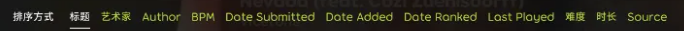

# Part 3: 界面介绍及使用

## 工具栏

工具栏坐落在屏幕的最上方，呈长条形横跨整个显示界面。

osu!lazer 将工具栏分为左右两部分，将依次进行介绍：

### 左栏

- ：点击后可打开游戏设置面板，也可以使用 `Ctrl + O`。
- ：点击后可以回到主菜单。你也可以使用 `Alt + Home`回到主菜单。
- ：展示了目前Lazer中可用的游戏模式。
  - 默认的四个内置游戏模式：osu!、osu!taiko、osu!catch 和 osu!mania排列在左侧；右侧出现的其他图标代指已经安装的其他Ruleset。
  - 有关更多安装Ruleset的内容可以在[**这里**](/docs/lazer/ruleset-man.md)获取详细信息。

:::tip 小提示

你可以按照游戏模式顺序，按下 `Ctrl + 数字键`快速跳转到相应模式。

:::

### 右栏

Lazer已经将网站的大多数功能嵌入进了游戏。你可以使用右侧的按钮访问下列界面：

| 图标 | 功能 | 备注 |
| :-: | :-: | :-: |
|  | 新闻 | 看看 osu! 社区最近发生了什么 |
|  | 更新日志 | osu! 最近的更新变化 |
|  | osu!wiki | 社区的共享知识库 |
|  | 排行榜 | 看看现在谁最强 |
|  | 谱面列表 | 也可以按下 `Ctrl + B` |
|  | 聊天面板 | 也可以按下 `F8` |
|  | 个人资料 | 显示你所有的好友，或者在这里搜索在线的任何用户 |
|  | 正在播放 | 查看并控制正在播放的歌曲 |

其中，“正在播放”的展开样式如图：

- ：点击打开你的用户页。
  - 这一部分还可以在完成单次游戏后显示排名和pp信息。就像这样：
  
- ：显示时间信息。
  - 下面的 “running xxxxxx”展示了Lazer一次已经运行的时长。
  - 可以点击该区域切换时钟样式，一共四种：
    - 
    - 
    - 
    - 
- ：**通知栏**。也可以使用 `Ctrl + N` 打开通知栏。

## 通知与通知栏

通知栏区域存放了Lazer的各种通知。

### 弹出通知

弹出通知会出现在屏幕右侧，从上到下排列。可以用以下方式与之互动：

- 按住鼠标左键向屏幕左侧拖放通知可以把通知*曹飞*，表示“已读”。

  
- 点击通知右侧的对号也可以实现同样的操作。

  
- 将通知向右侧滑动，会将通知收纳进通知栏。

  

### 通知区

通知区会展示各种通知与任务的状态：

不同状态的通知使用不同颜色表示，这些颜色显示在左侧：

- 绿色：新通知
- 黄色：任务准备中（如连接服务器）
- 蓝色：任务进行中（如下载、导入）
- 红色：任务失败

对于运行中的任务，可以点击通知右侧的 `×` 图标，或者右键单击通知停止任务进程。

:::info 你知道吗

1. 在 Windows 平台上，自动更新过程无法通过此方式取消，只能通过退出游戏中止。（怎么跟巨硬学了这个）
2. 已取消/失败的任务**无法**直接重试。

:::

## 选歌界面

终于要进入最核心的区域了。

选歌界面的左侧显示谱面信息，排行榜等信息，右侧则显示谱面列表。

### 谱面信息

转到左侧的显示区域，上方会显示谱面的基本信息，包含曲绘，难度名，歌名，作曲家，谱师等信息。

点击 `mapped by XXX` 中的蓝字转到谱师个人主页。

:::info 提示

即使蓝字显示的是谱面上传者的名称，点击客串难度的该位置也会跳转到客串难度谱师的主页。

:::

下方的五个数字分别表示**游玩长度，BPM，圆圈总数，滑条总数**和**转盘总数。**

下面显示有关当前难度的属性，包含圆圈大小，准度要求，难度星级，掉血速度和缩圈速度。

下面有五个选项，每个选项包含不同的信息显示。

- **"Details"：** 显示当前难度的更多谱面信息

  
- **"Local"：** 显示当前难度的本地排行榜

  
- **"Global"：** 显示当前难度的全球排行榜

  
- **"Country"：** 显示当前难度的地区排行榜。您需要osu!Supporter来使用该功能。

  
- **"Friend"：** 显示当前难度的好友排行榜。您需要osu!Supporter来使用该功能。

  

在排行榜中，点击榜单右上角按钮来显示当前选中mod的排行榜。例如你当前选中了 Hard Rock，那么勾选后就会显示当前难度下带 Hard Rock 成绩的排行榜。你同样需要 osu! 支持者来使用该功能。

### 功能区

左下角可以对谱面加mod，随机选择谱面，或者对谱面进行管理。

:::info 提示

这里仅仅介绍mods菜单的使用方法和操作细节。有关mods的内容将在下面新开一个章节专门介绍。

:::

点击"mods"打开mod菜单：

看不懂Lazer的新mod什么意思？**鼠标悬停在mod上方可以显示预览**。

当在设置中启用“在选择模组时自动聚焦搜索框”选项后，打开菜单后直接输入mod名称就可以筛选你想选择的mod，支持缩写。

#### 模组预设

在最左侧你可以管理自己的模组预设。在选定mod的情况下，点击加号创建新的预设。

在预设中你可以输入预设的名称和描述。点击添加预设来保存你的mod预设。

#### 模组设置

在Lazer中，一些mods允许你进行进一步的配置。比如Double Time。点击左下角“自定义模组”按钮来详细配置mod。如果你选择了多个mod，则会在面板上显示所有可供配置的mod设置。

---

按钮会让Lazer通过设置中的算法为你随机挑选一张谱面。

:::tip 小提示

不小心点到了 Random？按住 `Shift` 回到随机选择之前的那一张谱面。

:::

当按住 `Shift` 时，会变成。

---

点击按钮打开谱面设置菜单。

由左至右分别是：

- **管理收藏夹**，点击以管理你创建的所有收藏夹。
- **删除该谱面的所有难度**
- **标记为已玩过**
- **清除该谱面下所有难度的成绩**
- **编辑谱面**

### 搜索与筛选区

右上角的这一部分允许您通过不同的方式查询你需要的谱面。

#### 搜索

:::info 信息

关于谱面搜索功能，详见 [osu!wiki](https://osu.ppy.sh/wiki/zh/Beatmap_search)。

:::

搜索框不仅可以执行常规的字符串匹配搜索，还可以使用下面的比较符和关键词进行高级搜索。

这些是在Lazer中可以使用的比较符：

| **比较符** | **描述** |
| :-: | :-: |
| `=` | 等于 |
| `:` | 等于 |
| `<` | 小于 |
| `>` | 大于 |
| `<=` | 小于等于 |
| `>=` | 大于等于 |

这些是在Lazer中可以使用的关键词：

| **比较符** | **描述** |
| :-: | :-: |
| `artist` | 曲师 |
| `title` | 歌名 |
| `creator` | 谱面难度作者 |
| `diff` | 谱面难度名称 |
| `ar` | 缩圈速度 |
| `cs` | 圆圈大小 |
| `od` | 判定严度 |
| `hp`,`dr` | 掉血速度 |
| `key`,`keys` | 按键数量（osu!mania） |
| `star`,`stars` | 星数 |
| `bpm` | 歌曲速度 |
| `length` | 游玩时间（单位为秒） |
| `status` | 谱面状态；值为 `ranked`、`approved`、`pending`、`notsubmitted`、`unknown`、`loved` 其一，或者简写为 `r`/`a`/`p`/`n`/`u`/`l`。允许用英文逗号分隔的多个值 (`,`) |
| `played`,`lastplayed` | 距上次游玩的时间。允许按 `#y#M#d#h#m#s` 格式输入（年月日时分秒）。比如，`2d5s` 表示“2天5秒”。 |
| `divisor` | 音符时值的分母 |

例如，要搜索处于已上架 (Ranked) 与社区喜爱 (Loved) 状态的谱面：`status=r,l`

#### 筛选

- 拖动两边的手柄来按照星级难度搜索谱面。
- 使用下拉菜单来根据收藏夹检索谱面。
- 使用这里列出的排序方式：来对下面列表里所有的谱面排序。
- 在除osu!以外的所有模式中，勾选后，谱面列表中会显示由 osu! 模式转化来的难度。

### 谱面操作

在谱面标题上，会显示歌名、曲师、谱面状态及包含的谱面难度信息。

在单个谱面set中，所有难度会按照难度星级由上至下进行排序。已经玩过并且设下等级的难度，会在难度前显示评级。

鼠标悬停在set标题上的图标来显示具体的难度星级：

如果选择的set包含不同游戏模式的谱面难度，则会在谱面标题上显示该信息。

在上面的例子中，osu!taiko游戏模式的难度会变暗。这是因为当前选择的游戏模式为osu!模式，并非osu!taiko模式。

:::tip 小提示

除所选模式不同外，当同一谱面中的难度不符合筛选条件时，对应图标也会变暗

点击变灰的难度后，会自动调整条件，以选中该难度：

- 若模式不同，则会切换到对应模式；
- 若筛选条件不符，则会清除筛选；

:::

#### 右键菜单

在谱面上点击右键会展开右键菜单：

- **开始游玩** 会开始游玩当前选择的谱面。双击当前难度或者点击右下角的粉饼也可以开始游戏。
- **编辑** 会将该谱面使用编辑器打开。
- **Details** 会在游戏内置网页上打开谱面主页。
- 鼠标悬停在 **Collections** 会展开收藏夹列表。可以选择收藏夹并将该谱面添加到收藏夹中。
- **隐藏** 将会隐藏该难度。
  - 如果当前set下存在隐藏过的难度，那么点击右键会显示 **"Restore all hidden"** 选项。点击以取消隐藏当前set下的所有隐藏了的难度。

### 开始游玩

**点击右下角跳动的 osu! Cookie（或者按下 `Enter`），享受速通腱鞘炎的快感！**

使用键盘上的 `Z` 键和 `X` 键击打物件，使用你的鼠标/数位板/手柄/触摸屏等位置输入设备来精准定位要击打的物件！你也可以在设置中，绑定适合自己的键位设定。

下面的教程假设你已经知道如何游玩osu!主模式。如果你还不清楚osu!怎么玩，推荐你获取[这张谱面](https://osu.ppy.sh/beatmapsets/1011011#osu/2116202)来学习一下！

