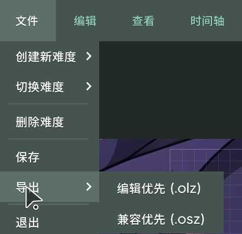
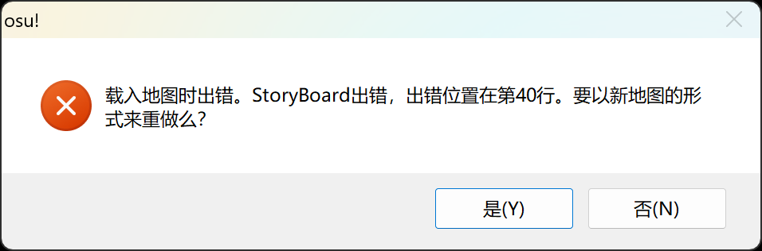

# lazer-stable 谱面互转指南

随着 osu!lazer 谱面编辑器的加入与改善，越来越多的作图者在使用 osu!lazer 编辑他们的谱面！

然而，目前的 lazer 编辑器并非十全十美！比如：

- 没有故事板编辑器
- 无法直接提交谱面
- 没有谱面专有目录

如果你很在意上面的问题（或者想在 osu!stable 里测试你的图），但是你还是很享受 osu!lazer 既有的编辑体验，那么这篇文章可能适合你。

## 导出与导入

### osu!stable 导出

在主界面中点击 `Edit`，选择你要导出的谱面、进入编辑器，然后点击`文件 -> 导出图包...`，导出位置会自动打开。

要导入谱面，直接打开即可。

### osu!lazer 导出

首先在 osu!lazer 中选择要导出的谱面，任选一个难度后：

- 按 `F3` 或点击 `Options`，然后点击 `Edit beatmap`
- 或者右键单击谱面/难度卡片，然后点击`编辑`

这样你就进入了编辑器。此后点击菜单的`文件 -> 导出`，选择`兼容优先 (.osz)`（`.osz` 是 osu!stable 目前支持的包格式！）。



稍后会弹出一个通知，提示导出已完成。点击这个通知，会帮你打开导出文件所在位置。如果没打开也无所谓，一般情况下，Windows 版本 osu!lazer 所有导出文件的位置在 `C:\Users\<你的用户名>\AppData\Roaming\osu\exports`（Linux 版待补充）。

然后选中这个文件，选用 **osu!stable** 打开。在打开方式菜单中显示的都是 `osu!`，但是从图标上很容易看出来（深色的就是）。

:::info 提示

仅当你使用 osu!lazer 编辑并保存过谱面后，这个错误才会发生。

:::

启动稳定版后，会显示通知告诉你“无法解析谱面头部，谱面可能已损坏！”。如果进入编辑器，则会报错。



不用担心，你的心血没有白费，我们在下一步会解决这个问题。

## 手动编辑

我们需要手动打开刚刚导入的谱面文件。虽然报错了，但是文件依然在正确的目录内。

打开文件管理器，转到 osu!stable 的安装文件夹的歌曲目录（通常是 `C:\Users\<你的用户名>\AppData\Local\osu!\Songs`）。点一下`修改日期`栏，让文件按修改日期从新到旧排序。最上面的文件夹就是刚刚导出的谱面了。

进入目录，右键单击 `.osu` 文件，选择用记事本（或者你喜欢的编辑器）打开。根据上面的弹窗，你可以定位到出问题的位置。

在新版本 osu!lazer 导出的谱面中，问题通常出现在 `.osu` 文件的 `[Events]` 小节，你会发现多了几行缺少参数、明显很不同的命令，可能如下：

```osu
[Events]
0,0,"cover.jpg",0,0
2,48577.86047984592,49772.32558139535
2,95845.30233467814,100005.32558139534
```

在上面的例子中，把最下面两行删除、保存即可。然后按下 `F5` 刷新谱面，就能正常加载了。

<Highlight color="#ff4296">你学会了吗？</Highlight>
