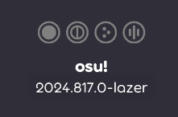
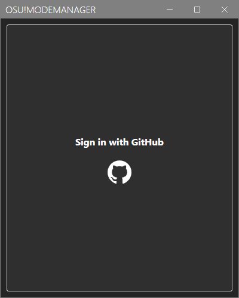
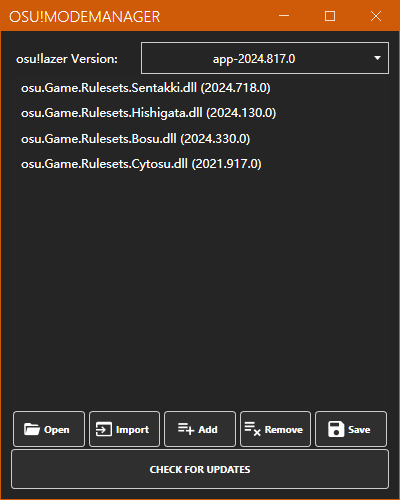
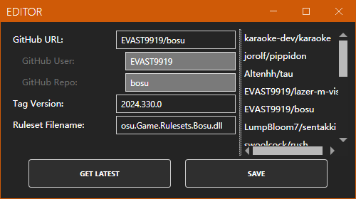
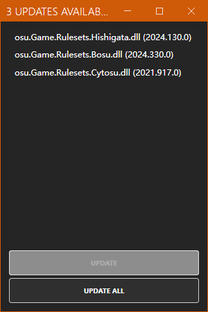
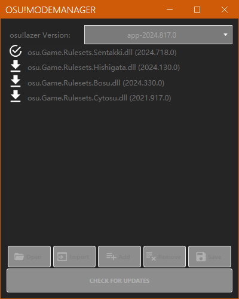

# lazer ruleset 快速上手指南

从 osu!lazer 开始，osu! 引入了<Highlight color="#ff66aa">**Ruleset**</Highlight> 的概念。

日常使用的环境下，对 Ruleset 的了解并不需要太过深入，只需要知道：

- Ruleset 属于 osu!lazer 的附加组件（即 *Mod / Addon*）
- Ruleset 可以为游戏引入新功能，一般是游戏模式
- Ruleset 是一个或一组 `.dll` 动态链接库文件
- Ruleset 不受 osu! 官方支持（也就是说不会随 osu! 更新）

## 获取

目前 Rulesets 多数来自 GitHub，由 C# 源码编译生成发布文件。常见的获取方法有以下两种：

:::warning 注意

介于 Ruleset 插件的性质：

- Ruleset 可能与你的版本游戏不兼容
- Ruleset 可能导致游戏无法正常使用某些功能（如分数提交）或报错
- 你可能无法在某些平台环境下生成或使用 Ruleset

在安装 Ruleset 时，请考虑上述几点，并记得做好安全措施（如备份）。

如果你在使用某个 Ruleset 时遇到了问题，可以向其开发者提出来。

:::

### 从源码生成

:::info 说明

取决于你使用的方法，需要准备的环境可能稍有不同，但至少需要：

- .NET 开发工具包 (SDK)
- 基本的命令行使用技能

:::

Ruleset 所在仓库一般都是以 C# 项目的形式呈现，你可以将这些仓库的源码拉到本地（无论使用 `git clone` 还是手动从网站下载源码），然后进行生成。比较推荐的方法有：

- 使用 Visual Studio 等编辑器自带的生成功能
- 使用命令行：在项目目录执行 `dotnet build`

生成成功后，你就可以在项目目录找到生成的 Ruleset 文件，它通常位于 `<项目目录>/bin/Debug` 目录下。

### 自动

使用外部工具获取并管理 Ruleset。Windows 环境下比较好用的工具是 [osu! ModeManager](https://github.com/starflash-studios/Osu-ModeManager)。

:::tip 支持

osu! ModeManager 的原作者 [starflash-studios](https://github.com/starflash-studios) 有一段时间没在更新这个项目了。

如有需要，我们有一个正在持续维护的[分支](https://github.com/osu-atri/Osu-ModeManager)，你可以在这里获取较新版本。

:::

以上述工具为例，下载版本压缩包并解压出所有文件后，找到目录下的 `Osu!ModeManager.exe` 即可直接运行。

首次运行时，程序会先尝试从注册表等判断 osu!lazer 的安装位置，并在一个文件选择框中显示出来。确认文件夹位置正确后即可点击`确定`。

为了获取 Ruleset 的版本信息与下载数据，首先需要登录你的 GitHub 账号。登录成功后则会进入主界面：

上半部分：

- `osu!lazer Version`: 显示并切换要设置 Ruleset 的版本。
- 列表：列出配置文件中的 Ruleset 内容。

下半部分为操作按钮：

- `Open`: 打开所选版本所在目录
- `Import`: 从配置文件导入 Ruleset 设置
- `Add`: 从 GitHub 仓库中添加 Ruleset
- `Remove`: 删除所选 Ruleset
- `Save`: 保存所有更改
- `Check for Updates`: 下载最新版本的 Ruleset

可以先点击 `Add`，从列表中选择 Ruleset 并添加，具体的操作流程：

- 从右侧列表中选择想要添加的 Ruleset
- 一段时间后会自动加载出版本号与文件名。如果没有可点击 `Get Latest` 手动更新
- 点击 `Save` 将其添加到配置文件

:::note 冷知识

通过对源码的一顿分析，发现列表中的 Ruleset 全部来自 [ppy/osu 仓库中的某个 Issue 评论](https://github.com/ppy/osu/issues/5852)。由于它已经过期且无法列出所有 Ruleset，未来可能会修改这里的逻辑。

:::

在添加好心仪的 Ruleset 后，点击主界面的 `Check for Updates` 下载它们：

- 需要下载或更新的 Ruleset 左侧会显示下载图标
- 完成或最新的 Ruleset 左侧会显示对钩图标

如果发现可下载的新版 Ruleset 则会弹出弹窗，你可以在其中选择更新。

更新完成后，记得点击主界面的 `Save`，将更改全部保存。下次启动 osu!lazer 时，就可以玩到新功能了！

### 手动

这里指你自己将 Ruleset 文件放到 osu!lazer 的目录。

Windows 环境一般情况下，osu!lazer 的文件目录位于 `<用户根目录>/AppData/Local/osulazer`。选择你要使用 Ruleset 的版本文件夹并进入，然后将 Ruleset 的**所有**文件放在其中即可。

:::info 提示

在 osu!lazer 运行期间你无法直接更改已加载的 Ruleset 文件。若要更改，请先**完全退出** osu!lazer（如果在任务管理器中仍然能看到，可结束其进程）。

:::

## 使用

如果文件完整且操作正确，打开 osu!lazer 后，你新安装的 Ruleset 会以游戏模式的形式，出现在顶栏左侧，排在基本的 4 个游戏模式后面。切换到新模式，开始享用吧！

如果出现以下情况：

- 游戏弹出通知，提示有错误发生
- Ruleset 的图标没有出现（通常伴随着上一种现象）
- 游戏无法启动

那么可能是 Ruleset 本身出了问题。请参照下文进行修复。

## 修复

如果是 Ruleset 导致 osu!lazer 出错，在不影响正常游玩体验的情况下一般可以忽略。若出现了比较严重的问题（如连续出现错误通知，游戏无法启动等），请考虑手动修复。

- 打开该版本的 osu!lazer 所在目录（如上文所述）
- 找到你最近安装的 Ruleset 文件（一般来说按修改时间排序容易找到）
- 将你认为有问题的文件删除
- 尝试启动 osu!lazer

这种方式一般能解决多数 Ruleset 导致的问题。如果尝试修复后依然出现问题，或者你不知道如何修复，则建议你重新安装 osu!lazer。

:::info 提示

由于 osu!lazer 的数据与基础组件是分开存储的，卸载 osu!lazer 本身不会影响到你的文件。

:::

如果你有一些基本的开发能力，想将这个问题报告给开发者，可以去找 osu!lazer 事发时的日志文件，与问题描述一起提交到 Ruleset 所在仓库。
