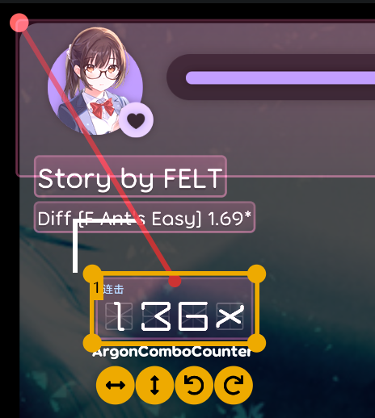

# 技术相关

osu! 涉及的专业领域术语。

## 乐理 {#music}

音乐理论 (**Music Theory**)，详见 [wiki](https://osu.ppy.sh/wiki/zh/Music_theory)

| 英文 | 中文 | 备注 |
| :-- | :-- | :-- |
| Beat | 拍，拍子，节拍 | 对应时间线白线间距 |
| Downbeat | 强拍，下拍 | 通常是小节的第一拍 |
| Upbeat | 弱拍，上拍 | 通常跟在强拍之后 |
| Chorus | 副歌，合唱 | 现阶段以*副歌*意为主 |

## 多媒体 {#media}

| 英文 | 中文 | 备注 |
| :-- | :-- | :-- |
| Bit rate | 比特率 | 上架要求 128~192 kbps |

## 设计 {#design}

| 英文 | 中文 | 备注 |
| :-- | :-- | :-- |
| Sprite | 精灵图 | 对应一个图像，具有精灵一般可变换的属性（例如移动旋转缩放等） |
| Transform | 变换 | 在这里通常指元素属性上的更改过程 |
| Anchor | 锚点 | 对于一个组件来说，在容器中*相对*位置的**原点** |
| Origin | 原点 | 对于组件本身，相对坐标对应的点 |
| Margin | 边距 | 从组件实际内容到容器边界（或屏幕边缘）的距离 |
| Spacing | 间距 | 在布局设计中一般指一批组件之间相距的距离 |
| Wireframe | 线框，线框图 | 设计方面通常用于确定大体设计模版，这里是来自新版连击显示的数字背景 |

如果表格中的表述过于抽象，可以看看下面的示例图：

在这个图中，选中组件的**锚点**位于左上角，**原点**在顶部中央处。
